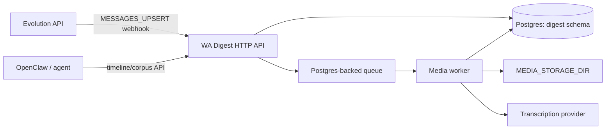

# Architecture

WA Digest is a companion service for Evolution API. It captures WhatsApp webhook data, stores normalized facts in a `digest` schema, processes media asynchronously, and exposes timelines/corpus exports for agents.

## Principles

1. **Companion, not fork.** WA Digest does not patch Evolution core for normal operation.
2. **Facts, not synthesis.** The service emits structured timelines, transcripts, statuses, and corpus exports. Agent-specific summarization lives outside this repo.
3. **Postgres is the durable boundary.** Evolution owns its schemas; WA Digest owns only schema `digest`.
4. **Media processing is asynchronous.** Webhooks must persist and enqueue work quickly; workers handle transcription and media analysis.
5. **Historical media is honest.** Future media can be captured reliably with storage/webhook configuration. Historical media through linked-device APIs is best-effort. ZIP import is the practical archive path.

## Runtime Shape

## Layers

- `src/types.ts`, `src/config.ts`, `src/utils.ts`: core shared contracts and helpers.
- `src/evolution/`: webhook normalization and Evolution-facing adapters.
- `src/media/`: media resolution and processing.
- `src/transcription/`: provider facade and provider adapters.
- `src/store/`: persistence boundary.
- `src/server.ts`, `src/cli.ts`: application surfaces.

## Active Decisions

See [docs/adr/README.md](adr/README.md). The current architecture is governed by ADR-0001 through ADR-0007.
